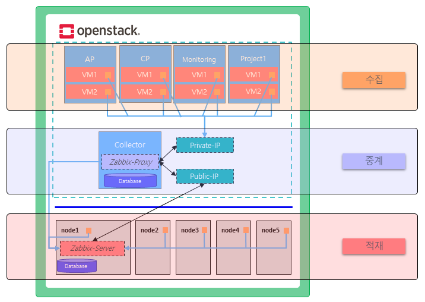

### [Index](https://github.com/PaaS-TA/Guide) > [Monitoring Architecture](PAAS-TA_MONITORING_ARCHITECTURE.md) > IaaS

# IaaS Monitoring Architecture

### │ IaaS  Monitoring Architecture
PaaS-TA IaaS 모니터링은 PaaS-TA 플랫폼을 운영하는 가상 머신들과 이들이 동작하는 인프라스트럭처 영역, 즉 전통적 의미의 물리적인 컴퓨팅 자원의 모니터링을 말하며 이러한 물리적인 컴퓨팅 자원의 클러스터링을 구현하는 **OpenStack 오픈 소스 프로젝트**를 기반으로 개발되었다.  
모니터링 도구로는 PaaS-TA 4.6 버전 이전에서 Monasca가 활용되었다가 지원이 중단되었고 현재는 Zabbix로 대체되었다.  

  

OpenStack 환경에서 프로젝트 별로 생성된 VM들의 모니터링 정보를 수집하거나 전송하기 위해서 qcow2 포맷의 이미지를 생성할 때 기본적으로 Zabbix Agent를 설치함으로 Zabbix 모니터링 환경을 구성한다. 만들어진 이미지를 이용하여 VM을 생성하게 되면 Zabbix Agent가 실행되며 이렇게 수집한 데이터를 Zabbix Proxy에 전송함으로 Zabbix Server에 대한 부하를 줄이고 성능을 향상을 기대할 수 있는 프록시 구성 방식을 채택하였다.  
이뿐 아니라 OpenStack 환경에서 생성된 VM은 외부 네트워크와 통신이 가능하지만 외부에서는 접근할 수 없는 가상 네트워크 영역에 해당하는 문제가 있어 이를 해결하기 위한 외부와 내부 네트워크의 통신 중계 역할도 Zabbix Proxy가 담당하고 있다. 이 때 프록시 노드에 Public IP를 할당하게 되고 외부 네트워크와 통신이 가능하게 만듦으로 Zabbix Server가 Zabbix Proxy의 상태를 확인할 수 있게 된다. Zabbix Proxy로 중계된 데이터는 실제 물리 장비에서 설치되어 동작하는 Zabbix Server에 모니터링 데이터를 전송하여 데이터를 관리한다.  
이때 물리 노드(클러스터링 구성된 실제 서버 장비)에서도 Zabbix Agent를 함께 설치/운영함으로 해당 노드에 대한 인프라 시스템 자원 사용량을 쉽게 확인할 수 있다.

### [Index](https://github.com/PaaS-TA/Guide) > [Monitoring Architecture](PAAS-TA_MONITORING_ARCHITECTURE.md) > IaaS