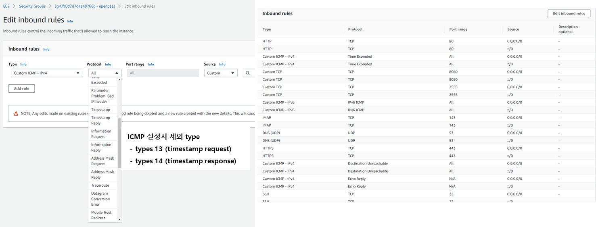

### [Index](https://github.com/PaaS-TA/Guide-eng) > [Monitoring Install](PAAS-TA_MONITORING_INSTALL_GUIDE.md) > BOSH (+Monitoring Dashboard)


# BOSH Install Guide (+Using Monitoring Dashboard) 
1. [Outline](#1)  
 1.1. [Purpose](#1.1)  
 1.2. [Range](#1.2)  
 1.3. [References](#1.3)  
 
2. [BOSH Installation Environment Configuration and Installation](#2)  
 2.1. [BOSH Installation Procedures](#2.1)  
 2.2. [Inception Server Configuration](#2.2)  
 2.3. [BOSH Installation](#2.3)  
　2.3.1. [Prerequisite](#2.3.1)  
　2.3.2. [BOSH CLI and Dependency Installation](#2.3.2)  
　2.3.3. [Installation File Download](#2.3.3)  
　2.3.4. [BOSH Installation](#2.3.4)  
　　2.3.4.1. [BOSH Installation Variable File](#2.3.4.1)  
　　2.3.4.2. [BOSH Installation Option File](#2.3.4.2)  
　　2.3.4.3. [BOSH Installation Shell Script](#2.3.4.3)  
　2.3.5. [BOSH Installation](#2.3.5)  
　2.3.6. [BOSH Log in](#2.3.6)  

3. [BOSH Option File Utilization](#3)  
 3.1. [CredHub](#3.1)   
　 3.1.1. [CredHub CLI Installation](#3.1.1)  
　 3.1.2. [CredHub Log in](#3.1.2)  
 3.2. [Jumpbox](#3.2)   

4. [Others](#4)  
 4.1. [Create BOSH Login Script](#4.1)   


## Executive Summary

This document is an installation guide for BOSH2 (hereinafter referred to as BOSH), which describes how to configure and use an environment that can run BOSH.

# <div id='1'/>1. Document Outline

## <div id='1.1'/>1.1. Purpose
BOSH, which can deploy service systems in cloud environments, is an open-source project that integrates release engineering, development, and software lifecycle management, and aims to install BOSH in an Inception environment (installation environment).

## <div id='1.2'/>1.2. Range
This document is based on installing and configuring packages and libraries for BOSH installation based on the Linux environment (Ubuntu 18.04) and using them to install BOSH.

## <div id='1.3'/>1.3. References

This document was written by referring to Cloud Foundry's BOSH Document and Cloud Foundry Document.

BOSH Document: [http://bosh.io](http://bosh.io)

BOSH Deployment: [https://github.com/cloudfoundry/bosh-deployment](https://github.com/cloudfoundry/bosh-deployment)

Cloud Foundry Document: [https://docs.cloudfoundry.org](https://docs.cloudfoundry.org)


# <div id='2'/>2. BOSH Installation Environment Configuration and Installation

## <div id='2.1'/>2.1. BOSH Installation Procedures
Inception (PaaS-TA installation environment) is an installation environment for installing BOSH and PaaS-TA, a VM or server equipment.  
OS Version is based on Ubuntu 18.04 (Stemcell 1.34). You must manually create an Inception VM in IaaS.

Inception VM recommends Ubuntu 18.04, vCPU 2 Core, Memory 4G, and Disk 100G or higher.

## <div id='2.2'/>2.2.  Inception Server Configuration

The Inception server is a deployment task execution server with an environment such as packages, libraries, and Manifest files required to install BOSH and PaaS-TA.  
The Inception server shall be capable of external communication.

The components to be configured on the Inception server for BOSH and PaaS-TA installation are as follows.

- BOSH CLI 6.1.x and above
- BOSH Dependency : ruby, ruby-dev, openssl, etc.
- BOSH Deployment: manifest deployment for Bosh Installation  
- PaaS-TA Deployment : manifest deployment for PaaS-TA Installation

## <div id='2.3'/>2.3.  BOSH Installation

### <div id='2.3.1'/>2.3.1.    Prerequisite

- This installation guide is based on Ubuntu version 18.04.  

- Set the ports that should be opened by the IaaS security group.

|Port|Note|
|---|---|
|22|BOSH Used|
|6868|BOSH Used|
|25555|BOSH Used|
|53|PaaS-TA Used|
|68|PaaS-TA Used|
|80|PaaS-TA Used|
|443|PaaS-TA Used|
|4443|PaaS-TA Used|


- Disable ICMP types 13 (timestamp request) and types 14 (timestamp response) rules of the IaaS security group inbound. (CVE-1999-0524 ICMP timestamp response security issue applied)  

  Ex. - AWS security group config)  
    


### <div id='2.3.2'/>2.3.2.    BOSH CLI and Dependency Installation

- BOSH Dependency Installation (Ubuntu 18.04)

```
$ sudo apt install -y build-essential zlibc zlib1g-dev ruby ruby-dev openssl libxslt1-dev libxml2-dev libssl-dev libreadline7 libreadline-dev libyaml-dev libsqlite3-dev sqlite3
```

- BOSH Dependency Installation (Ubuntu 16.04)

```
$ sudo apt install -y libcurl4-openssl-dev gcc g++ build-essential zlibc zlib1g-dev ruby ruby-dev openssl libxslt-dev libxml2-dev libssl-dev libreadline6 libreadline6-dev libyaml-dev libsqlite3-dev sqlite3
```

- BOSH CLI Installation

```
$ mkdir -p ~/workspace
$ cd ~/workspace
$ sudo apt update
$ curl -Lo ./bosh https://github.com/cloudfoundry/bosh-cli/releases/download/v6.4.7/bosh-cli-6.4.7-linux-amd64
$ chmod +x ./bosh
$ sudo mv ./bosh /usr/local/bin/bosh
$ bosh -v
```

The BOSH2 CLI has the function of generating BOSH certificate information when BOSH is installed.  
Cloud Foundry's default BOSH CLI authentication certificates are limited to one year.  
The BOSH authentication certificate is a certificate required for communication between the BOSH internal components.  
If a year after BOSH is installed, the certificate needs to be renewed.  
certificate renewing guide video - [Link](https://youtu.be/zn8VO-fHAFE?t=1994)

### <div id='2.3.3'/>2.3.3.    Installation File Download

- Download if the Deployment for BOSH installation does not exist.
```
$ mkdir -p ~/workspace
$ cd ~/workspace
$ git clone https://github.com/PaaS-TA/paasta-deployment.git -b v5.6.2
```

- Check folder under paasta/deployment/paasta-deployment

```
$ cd ~/workspace/paasta-deployment
$ ls
README.md  bosh  cloud-config  paasta
```

<table>
<tr>
<td>bosh</td>
<td>Folder where the manifest and installation file for BOSH installation exists</td>
</tr>
<tr>
<td>cloud-config</td>
<td>Folder where IaaS network, storage, vm related setting files for VM Deployment are in</td>
</tr>
<tr>
<td>paasta</td>
<td>Folder where manifest and installation file for PaaS-TA AP Installation exists</td>
</tr>
</table>

After downloading the Monitoring Dashboard deployment file through the storage link, move (copy) some of the deployment files (below the `*-addon` directory) to the appropriate directory in the PaaS-TA deployment file as follows: If you need a specific version when downloading the monitoring dashboard deployment file, you can also download and use the `-b` option by referring to the branch or tag information in the repository.
```
$ git clone https://github.com/PaaS-TA/monitoring-deployment.git

$ cp -r monitoring-deployment/bosh-addon/* paasta-deployment/bosh/
$ cp -r monitoring-deployment/paasta-addon/* paasta-deployment/paasta/
```


### <div id='2.3.4'/>2.3.4.    BOSH Installation File

Shell Script files by IaaS exist in the ~/workspace/paasta-deployment/bosh folder for BOSH installation.  

Install BOSH by using Shell Script File.
The file name is deploy-{IaaS}-monitoring.sh.  
You can also modify {IaaS}-vars.ymlto set the variables that apply when installing BOSH.

<table>
<tr>
<td>aws-vars.yml</td>
<td>Variable settings file for BOSH installation in AWS environment</td>
</tr>
<tr>
<td>openstack-vars.yml</td>
<td>Variable settings file for BOSH installation in OpenStack environment</td>
</tr>
<tr>
<td>bosh-monitoring-vars.yml</td>
<td>Zabbix Agent Settings File for IaaS Monitoring Based on OpenStack Environments</td>
</tr>
<tr>
<td>deploy-aws.sh</td>
<td>Shell Script File for BOSH Installation in AWS Environment</td>
</tr>
<tr>
<td>deploy-openstack.sh</td>
<td>Shell Script File for BOSH Installation in an OpenStack Environment</td>
</tr>
<tr>
<td>bosh.yml</td>
<td>Manifest file that creates BOSH</td>
</tr>
</table>


#### <div id='2.3.4.1'/>2.3.4.1. BOSH Installation Variable File Setting

Set the Variable File according to the IaaS environment where BOSH is installed.

- When Installating AWS Environment 

```
$ vi ~/workspace/paasta-deployment/bosh/aws-vars.yml
# BOSH VARIABLE
bosh_client_admin_id: "admin"				# Bosh Client Admin ID
private_cidr: "10.0.1.0/24"				# Private IP Range
private_gw: "10.0.1.1"					# Private IP Gateway
bosh_url: "10.0.1.6"					# Private IP
director_name: "micro-bosh"				# BOSH Director Name
access_key_id: "XXXXXXXXXXXXXXX"			# AWS Access Key
secret_access_key: "XXXXXXXXXXXXX"			# AWS Secret Key
region: "ap-northeast-2"				# AWS Region
az: "ap-northeast-2a"					# AWS AZ Zone
default_key_name: "aws-paasta.pem"			# AWS Key Name
default_security_groups: ["bosh"]			# AWS Security-Group
subnet_id: "paasta-subnet"				# AWS Subnet
private_key: "~/.ssh/aws-paasta.pem"			# SSH Private Key Path (The path of a private key with access to the IaaS)
# MONITORING VARIABLE(When installing PaaS-TA Monitoring, pre-modify to the values of VMs to be installed in the future)
metric_url: "xx.xx.xxx.xxx"				# PaaS-TA Monitoring InfluxDB IP
syslog_address: "xx.xx.xxx.xxx"				# ls-router IP of Logsearch
syslog_port: "2514"					# ls-router Port of Logsearch
syslog_transport: "relp"				# Logsearch Protocol
```

- When Installing OpenStack Environment
    - bosh-monitoring-vars.yml file for IaaS monitoring is additionally included in an OpenStack Environment.
```shell script
$ vi ~/workspace/paasta-deployment/bosh/openstack-vars.yml
# BOSH VARIABLE
bosh_client_admin_id: "admin"				# Bosh Client Admin ID
director_name: "micro-bosh"				# BOSH Director Name
private_cidr: "10.0.1.0/24"				# Private IP Range
private_gw: "10.0.1.1"					# Private IP Gateway
bosh_url: "10.0.1.6"					# Private IP
auth_url: "http://XX.XXX.XX.XX:XXXX/v3/"		# Openstack Keystone URL
az: "nova"						# Openstack AZ Zone
default_key_name: "paasta"				# Openstack Key Name
default_security_groups: ["paasta"]			# Openstack Security Group
net_id: "XXXXXXXX-XXXX-XXXX-XXXX-XXXXXXXXXXXX"		# Openstack Network ID
openstack_password: "XXXXXX"				# Openstack User Password
openstack_username: "XXXXXX"				# Openstack User Name
openstack_domain: "XXXXXXX"				# Openstack Domain Name
openstack_project: "PaaSTA"				# Openstack Project
private_key: "~/.ssh/id_rsa.pem"			# SSH Private Key Path (The path of a private key with access to the IaaS)
region: "RegionOne"					# Openstack Region
# MONITORING VARIABLE(When installing PaaS-TA Monitoring, pre-modify to the values of VMs to be installed in the future)
metric_url: "10.0.161.101"				# PaaS-TA Monitoring InfluxDB IP
syslog_address: "10.0.121.100"				# ls-router IP of Logsearch
syslog_port: "2514"					# ls-router Port of Logsearch
syslog_transport: "relp"				# Logsearch Protocol
```
```shell script
$ vi ~/workspace/paasta-deployment/bosh/bosh-monitoring-vars.yml
#Zabbix agent
server_ip: "127.0.0.1"
listen_port: "10050"
server_active: "10.0.240.10:10051"
host_metadata: "zabbix"
```


#### <div id='2.3.4.2'/>2.3.4.2. BOSH Installation Option File

The option files used in the installation Shell Script are as follows.  

<table>
<tr>
<td>File Name</td>
<td>Description</td>
</tr>
<tr>
<td>uaa.yml</td>
<td>Apply UAA</td>
</tr>
<tr>
<td>credhub.yml</td>
<td>Apply CredHub</td>
</tr>
<tr>
<td>jumpbox-user.yml</td>
<td>Create BOSH Jumpbox user</td>
</tr>
<tr>
<td>cce.yml</td>
<td>CCE is applied when installing</td>
</tr>
</table>


#### <div id='2.3.4.3'/>2.3.4.3. BOSH Installation Shell Script

BOSH installation command starts with create-env.  
Can execute with BOSH Command rather than Shell. Options vary depending on the IaaS environment installed.  
Delete the installed BOSH using the delete-env command.

BOSH Installation Option is as shown below.

<table>
<tr>
<td>--state</td>
<td>It is a file generated when the BOSH installation command is executed, and IaaS configuration information of the installed BOSH is stored. (Backup Required)</td>
</tr>
<tr>
<td>--vars-store</td>
<td>A file generated when the BOSH installation command is executed, and certificates and authentication information used by internal components of the installed BOSH are stored. (Backup Required)</td>
</tr>   
<tr>
<td>-o</td>
<td>Used to set the operation file to be applied during BOSH installation. <br>Settings such as CPI or Jumpbox-user, CredHub, etc. for each IaaS can be applied.</td>
</tr>
<tr>
<td>-v</td>
<td>Used when setting variables in the operation file or variables to be applied when installing BOSH. <br>It is divided into required or optional items according to the Operation file properties.</td>
</tr>
<tr>
<td>-l, --var-file</td>
<td>Used to read the variables created in the YAML file.</td>
</tr>
</table>

Run the command if you need to change the option in the installation shell script.

**│ AWS Environment Installation Script**
```
$ vi deploy-aws-monitoring.sh
```
```shell script
#!/bin/bash

bosh create-env bosh.yml \
    --state=aws/state.json \
    --vars-store=aws/creds.yml \
    -o aws/cpi.yml \
    -o uaa.yml \
    -o cce.yml \
    -o credhub.yml \
    -o jumpbox-user.yml \
    -o syslog.yml \
    -o paasta-addon/paasta-monitoring-agent.yml \
    -l aws-vars.yml \
    -l bosh-monitoring-vars.yml
```

**│ OpenStack Environment Installation Script**
```
$ vi deploy-openstack-monitoring.sh
```
```shell script
#!/bin/bash

bosh create-env bosh.yml \
    --state=openstack/state.json \
    --vars-store=openstack/creds.yml \
    -o openstack/cpi.yml \
    -o uaa.yml \
    -o cce.yml \
    -o credhub.yml \
    -o jumpbox-user.yml \
    -o openstack/disable-readable-vm-names.yml \
    -o syslog.yml \
    -o zabbix-agent.yml \
    -o paasta-addon/paasta-monitoring-agent.yml \
    -l openstack-vars.yml \
    -l bosh-monitoring-vars.yml
```

- Assign execution authority to Shell Script file

```
$ chmod +x ~/workspace/paasta-deployment/bosh/*.sh  
```


### <div id='2.3.5'/>2.3.5. BOSH Installation

Once the variable file and installation shell script are set up, proceed with the installation using the following command.  

- Run BOSH Installation Shell Script File

```
$ cd ~/workspace/paasta-deployment/bosh
$ ./deploy-{iaas}-monitoring.sh
```

- BOSH Installation Completed

```
  Compiling package 'uaa_utils/90097ea98715a560867052a2ff0916ec3460aabb'... Skipped [Package already compiled] (00:00:00)
  Compiling package 'davcli/f8a86e0b88dd22cb03dec04e42bdca86b07f79c3'... Skipped [Package already compiled] (00:00:00)
  Updating instance 'bosh/0'... Finished (00:01:44)
  Waiting for instance 'bosh/0' to be running... Finished (00:02:16)
  Running the post-start scripts 'bosh/0'... Finished (00:00:13)
Finished deploying (00:11:54)
Stopping registry... Finished (00:00:00)
Cleaning up rendered CPI jobs... Finished (00:00:00)
Succeeded
```


### <div id='2.3.6'/>2.3.6. BOSH Log in
When the BOSH is installed, {iaas}/creds.yml file is created under the BOSH installation folder.  
Creds.yml has BOSH credential information and logs into BOSH using credits.yml.  
After logging in to BOSH, PaaS-TA can be installed using the BOSH CLI command.  
**To deploy VMs using BOSH, you must log in to BOSH.**  
BOSH Log-in command is as follows.  

```
$ cd ~/workspace/paasta-deployment/bosh
$ export BOSH_CA_CERT=$(bosh int ./{iaas}/creds.yml --path /director_ssl/ca)
$ export BOSH_CLIENT=admin
$ export BOSH_CLIENT_SECRET=$(bosh int ./{iaas}/creds.yml --path /admin_password)
$ bosh alias-env {director_name} -e {bosh_url} --ca-cert <(bosh int ./{iaas}/creds.yml --path /director_ssl/ca)
$ bosh -e {director_name} env
```

## <div id='3'/> 3. BOSH Option File Utilization
### <div id='3.1'/>3.1. CredHub
CredHub is a repository of authentication information.  
If credhub.yml is applied as an Operation file during BOSH installation, then the certificate (Password) used by Deployment generated through BOSH is stored in CredHub.  
When authentication information is required, you can log in to CredHub through the CredHub CLI to check, modify, and delete authentication information.

#### <div id='3.1.1'/>3.1.1 CredHub CLI Installation
The CredHub CLI is installed in the Inception (installation environment) where BOSH is installed.

```
$ wget https://github.com/cloudfoundry-incubator/credhub-cli/releases/download/2.9.0/credhub-linux-2.9.0.tgz
$ tar -xvf credhub-linux-2.9.0.tgz
$ chmod +x credhub
$ sudo mv credhub /usr/local/bin/credhub
$ credhub --version
```
#### <div id='3.1.2'/>3.1.2. CredHub Log in
To log in to CredHub, log in using creds.yml in the Boch-deployment directory where BOSH was installed.

```
$ cd ~/workspace/paasta-deployment/bosh
$ export CREDHUB_CLIENT=credhub-admin
$ export CREDHUB_SECRET=$(bosh int --path /credhub_admin_client_secret {iaas}/creds.yml)
$ export CREDHUB_CA_CERT=$(bosh int --path /credhub_tls/ca {iaas}/creds.yml)
$ credhub login -s https://{bosh_url}:8844 --skip-tls-validation
```
Refer to the Other CLI Guide in the AP Usage Guide for more use guide on Credhub.

### <div id='3.2'/>3.2. Jumpbox
If you apply jumpbox-user.yml as an operation file during BOSH installation, create a Jumpbox user in the BOSH VM and access the BOSH VM.
The authentication key for access is generated by the BOSH itself, and the BOSH VM may be accessed through the authentication key.  
You can use Jumpbox to access the BOSH VM when checking the abnormalities or status of the BOSH VM.  

**💥 If cce.yml is added during BOSH installation, the password for BOSH's Jumpbox account is set to 90 days.**  
**Before the password expires, you must reconnect to BOSH to change the password and manage it. (Jumpbox account gets locked if not changed)**

```
$ cd ~/workspace/paasta-deployment/bosh
$ bosh int {iaas}/creds.yml --path /jumpbox_ssh/private_key > jumpbox.key
$ chmod 600 jumpbox.key
$ ssh jumpbox@{bosh_url} -i jumpbox.key
```

```
ubuntu@inception:~/workspace/paasta-deployment/bosh$ ssh jumpbox@10.0.1.6 -i jumpbox.key
Unauthorized use is strictly prohibited. All access and activity
are subject to logging and monitoring.
Welcome to Ubuntu 18.04.6 LTS (GNU/Linux 4.15.0-54-generic x86_64)
 * Documentation:  https://help.ubuntu.com
 * Management:     https://landscape.canonical.com
 * Support:        https://ubuntu.com/advantage
Last login: Thu Oct 17 03:57:48 UTC 2019 from 10.0.0.9 on pts/0
Last login: Fri Oct 25 07:05:42 2019 from 10.0.0.9
bosh/0:~$
```


## <div id='4'/>4. Others
### <div id='4.1'/>4.1. Create BOSH Login Script

Supports script generation to log in to BOSH from PaaS-TA 5.5
Change the location of the BOSH environment and script to the location you want to save, and run the script's BOSH_DEPLOYMENT_PATH, CURRENT_IAAS, BOSH_IP, BOSH_CLIENT_ADMIN_ID, BOSH_ENVIRONMENT, BOSH_LOGIN_FILE_PATH, BOSH_LOGIN_FILE_NAME.

- Modify settings in the Create BOSH Login Script

> vi ~/workspace/paasta-deployment/bosh/create-bosh-login.sh
```
#!/bin/bash
BOSH_DEPLOYMENT_PATH="<BOSH_DEPLOYMENT_PATH>" 	# (e.g. ~/workspace/paasta-deployment/bosh)
CURRENT_IAAS="aws"				# (e.g. aws/azure/gcp/openstack/vsphere/bosh-lite)
BOSH_IP="10.0.1.6"				# (e.g. 10.0.1.6)
BOSH_CLIENT_ADMIN_ID="admin"			# (e.g. admin)
BOSH_ENVIRONMENT="micro-bosh"			# (e.g. micro-bosh)
BOSH_LOGIN_FILE_PATH="/home/ubuntu/.env"	# (e.g. /home/ubuntu/.env)
BOSH_LOGIN_FILE_NAME="micro-bosh-login-env"	# (e.g. micro-bosh-login-env)
mkdir -p ${BOSH_LOGIN_FILE_PATH}
echo 'export CRED_PATH='${BOSH_DEPLOYMENT_PATH}'
export CURRENT_IAAS='${CURRENT_IAAS}'
export BOSH_CA_CERT=$(bosh int $CRED_PATH/$CURRENT_IAAS/creds.yml --path /director_ssl/ca)
export BOSH_CLIENT='${BOSH_CLIENT_ADMIN_ID}'
export BOSH_CLIENT_SECRET=$(bosh int $CRED_PATH/$CURRENT_IAAS/creds.yml --path /admin_password)
export BOSH_ENVIRONMENT='${BOSH_ENVIRONMENT}'
bosh alias-env $BOSH_ENVIRONMENT -e '${BOSH_IP}' --ca-cert <(bosh int $CRED_PATH/$CURRENT_IAAS/creds.yml --path /director_ssl/ca)
credhub login -s https://'${BOSH_IP}':8844 --skip-tls-validation --client-name=credhub-admin --client-secret=$(bosh int --path /credhub_admin_client_secret $CRED_PATH/$CURRENT_IAAS/creds.yml)
' > ${BOSH_LOGIN_FILE_PATH}/${BOSH_LOGIN_FILE_NAME}
```

- Run Create BOSH Login Script

```
$ cd ~/workspace/paasta-deployment/bosh
$ source create-bosh-login.sh
```


- Run BOSH Login with the created script

```
$ source {BOSH_LOGIN_FILE_PATH}/{BOSH_LOGIN_FILE_NAME}
```


### [Index](https://github.com/PaaS-TA/Guide-eng) > [Monitoring Install](PAAS-TA_MONITORING_INSTALL_GUIDE.md) > BOSH (+Monitoring Dashboard)