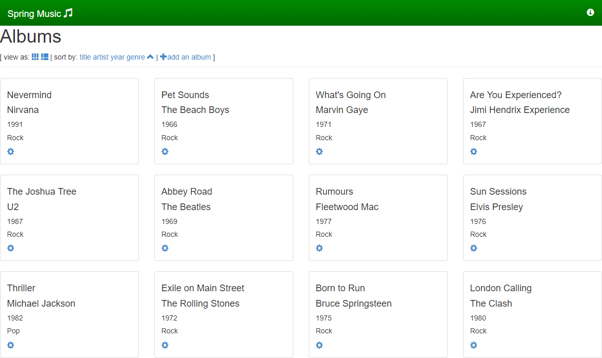
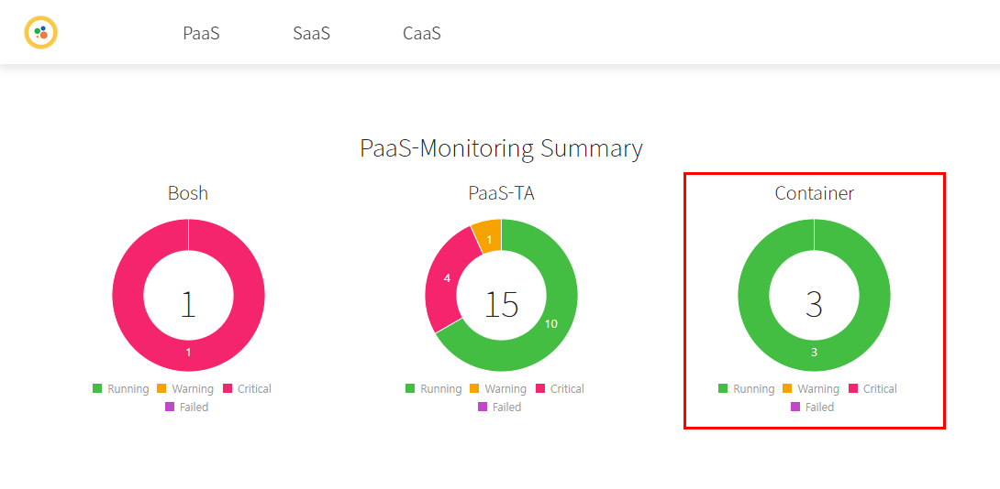
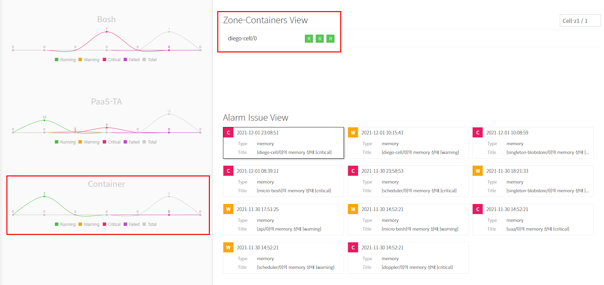
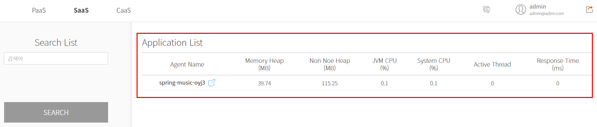

### [Index](https://github.com/PaaS-TA/Guide) > [Monitoring Install](PAAS-TA_MONITORING_INSTALL_GUIDE.md) > Application & Pinpoint Service


# Application & Pinpoint Service Pushing and Binding
1. [개요](#1)
2. [Application & Pinpoint Service 푸싱과 바인딩](#2)


## <div id="1">1. 개요
본 문서는 설치된 PaaS-TA 플랫폼에 애플리케이션을 푸시하고 서비스를 바인딩하는 방법에 대한 설명을 다루고 있다.


## <div id="2">2. Application & Pinpoint Service 푸싱과 바인딩


### 2.1. Sample Application 빌드와 푸시
샘플 앱 테스트를 위해 개발된 'spring-music' 소스를 Cloud Foundry Sample Applications 저장소로부터 내려 받는다.

```
$ cd ~/workspace
$ git clone https://github.com/cloudfoundry-samples/spring-music.git
```

내려 받은 소스를 빌드한다.

```
$ cd spring-music
$ ./gradlew clean assemble
```

`manifest.yml` 파일을 편집한다. `name` 값 정도를 사용자 임의대로 변경해 준다.

```
$ vi manifest.yml
```
```yaml
---
applications:
- name: spring-music-paasta
  memory: 1G
  random-route: true
  path: build/libs/spring-music-1.0.jar
  env:
    JBP_CONFIG_SPRING_AUTO_RECONFIGURATION: '{enabled: false}'
```

빌드팩 옵션을 추가해 앱을 푸시한다. `-b`는 빌드팩 추가 옵션, `--no-start`는 앱을 푸시한 후 시작시키지 않는 옵션이다. 즉 기본 옵션은 푸시 후 앱이 시작된다. 푸시가 완료되면 앱이 정상적으로 푸시되었는지 확인한다.

```
$ cf push -b java-buildpack-pinpoint --no-start

...

$ cf apps
Getting apps in org system / space paasta as admin...

name                  requested state   processes   routes
spring-music-paasta   stopped           web:0/1     spring-music-paasta-impressive-shark-pd.10.5.0.240.nip.io
```

만약 cf의 space가 지정되어 있지 않다면 다음과 같이 space를 지정해 준다.

```
$ cf create-space paasta
$ cf target -s paasta
```


### 2.2. Security Group과 User Provided Service 등록
`pinpoint-asg.json` 이라는 이름의 JSON 파일을 새로 생성한 후 아래와 같이 작성한다. 이때 `destination` 값을 작업자의 환경에 알맞게 수정한다.

```json
[
  {
    "protocol": "all",
    "destination": "10.5.0.0/24",
    "log": true,
    "description": "Allow tcp traffic to z1"
  }
]
```

'pinpoint'라는 security-group을 앞에서 생성한 JSON 파일을 이용해 등록하고 바인딩한다.

```
$ cf create-security-group pinpoint pinpoint-asg.json
$ cf bind-staging-security-group pinpoint
$ cf bind-running-security-group pinpoint
```

User Provided Service를 등록한다. 이때 작업자의 환경에 맞게 `application_name`, `collector_host` 값을 적절하게 수정해 주어야 하는 것에 유의한다.

```
$ cf cups pinpoint-monitoring-service -p '{"application_name":"spring-music-paasta","collector_host":"10.5.0.139","collector_span_port":"29996","collector_stat_port":"29995","collector_tcp_port":"29994"}' -t 'pinpoint'
```


### 2.3. Application과 Service의 바인딩
Application과 Service를 바인딩한다.

```
$ cf bind-service spring-music-paasta pinpoint-monitoring-service
```

Application을 시작시킨다.

```
$ cf start spring-music-paasta
```

Application이 실행되었으면 다음 명령어로 조회되는 URL(`routes`)을 인터넷 브라우저를 통해 접속해 앱이 정상적으로 서비스되고 있는지 확인할 수 있다.

```
$ cf apps
Getting apps in org system / space paasta as admin...

name                  requested state   processes           routes
spring-music-paasta   started           web:1/1, task:0/0   spring-music-paasta-brash-alligator-tz.10.5.0.240.nip.io
```



또한 Monitoring Dashboard에서도 사용자가 푸시한 Application에 대한 모니터링 정보를 확인할 수 있다.








### [Index](https://github.com/PaaS-TA/Guide) > [Monitoring Install](PAAS-TA_MONITORING_INSTALL_GUIDE.md) > Application & Pinpoint Service
