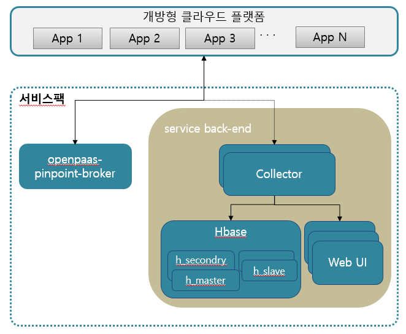

### [Index](https://github.com/PaaS-TA/Guide) > [Monitoring Install](PAAS-TA_MONITORING_INSTALL_GUIDE.md) > [SaaS] Pinpoint Monitoring


# Pinpoint Monitoring Install Guide
1\. [문서 개요](#1)  
　● [목적](#11)  
　● [범위](#12)  
　● [시스템 구성도](#13)  
　● [참고자료](#14)  
2\. [Pinpoint 서비스팩 설치](#2)  
　2.1 [Prerequisite](#21)  
　2.2 [설치 파일 다운로드](#22)  
　2.3 [Pinpoint Monitoring 설치 환경설정](#23)  
　　● [common_vars.yml](#231)  
　　● [pinpoint-vars.yml](#232)  
　　● [deploy-pinpoint.sh](#233)  
　　● [deploy-pinpoint-vsphere.sh](#234)  
　2.4. [Pinpoint Monitoring 설치](#24)  
　2.5. [서비스 설치 확인](#25)  
　2.6. [Security-Group 등록](#26)  
　2.7. [Pinpoint User-Provided Service 등록](#27)  
3\. [Sample Web App 연동 Pinpoint 연동](#3)  
　● [Sample Web App 구조](#31)  
　● [Sample Web App에 서비스 바인드 신청 및 App 확인](#32)  

# <div id='1'> 1. 문서 개요
## <div id='11'> ● 목적

본 문서(SaaS Monitoring Pinpoint 서비스팩 설치 가이드)는 전자정부표준프레임워크 기반의 PaaS-TA에서 제공되는 서비스팩인 Pinpoint 서비스팩을 BOSH 2.0을 이용하여 설치 하는 방법과 PaaS-TA의 SaaS 형태로 제공하는 Application 에서 Pinpoint 서비스를 사용하는 방법을 기술하였다.  
PaaS-TA 3.5 버전부터는 BOSH 2.0 기반으로 deploy를 진행하며 기존 BOSH 1.0 기반으로 설치를 원할경우에는 PaaS-TA 3.1 이하 버전의 문서를 참고한다.

## <div id='12'> ● 범위
설치 범위는 Pinpoint 서비스팩을 검증하기 위한 기본 설치를 기준으로 작성하였다.

## <div id='13'> ● 시스템 구성도

본 문서의 설치된 시스템 구성도이다.  
Pinpoint Server, HBase의 HBase Master, Collector , WebUI2로 최소사항을 구성하였다. 



<table>
  <tr>
    <th>구분</th>
    <th>Resource Pool</th>
    <th>스펙</th>
  </tr>
  <tr>
  <td>collector      </td><td>pinpoint_medium</td><td>2vCPU / 2GB RAM / 8GB Disk</td>
  </tr>
  <td>h_master      </td><td>pinpoint_medium</td><td>2vCPU / 2GB RAM / 8GB Disk</td>
  </tr>
  <tr>
  <td>haproxy_webui </td><td>services-small</td><td>1vCPU / 1GB RAM / 4GB Disk</td>
  </tr>
  <tr>
  <td>pinpoint_web          </0><td>services-small	</td><td>1vCPU / 1GB RAM / 4GB Disk</td>
  </tr>
</table>

## <div id='14'> ● 참고자료
[**http://bosh.io/docs**](http://bosh.io/docs)  
[**http://docs.cloudfoundry.org/**](http://docs.cloudfoundry.org/)

## <div id='2'> 2. Pinpoint 서비스팩 설치

### <div id='21'> 2.1. Prerequisite

1. BOSH 설치가 되어있으며, BOSH Login이 되어 있어야 한다.
2. cloud-config와 runtime-config가 업데이트 되어있는지 확인한다.
3. Stemcell 목록을 확인하여 서비스 설치에 필요한 Stemcell(ubuntu bionic 1.34)이 업로드 되어 있는 것을 확인한다.


> cloud-config 확인  
> $ bosh -e {director-name} cloud-config  

> runtime-config 확인  
> $ bosh -e {director-name} runtime-config  

> stemcell 확인  
> $ bosh -e {director-name} stemcells  


## <div id='22'/>2.2.  설치 파일 다운로드

- PaaS-TA를 설치하기 위한 deployment가 존재하지 않는다면 다운로드 받는다
```
$ cd ${HOME}/workspace
$ git clone https://github.com/paas-ta/common.git 
$ git clone https://github.com/paas-ta/monitoring-deployment.git
```


## <div id='23'> 2.3. Pinpoint Monitoring 설치 환경설정

${HOME}/workspace/monitoring-deployment/pinpoint-monitoring 이하 디렉터리에는 Pinpoint Monitoring 설치를 위한 Shell Script 파일이 존재한다.
	
### <div id='231'/>● common_vars.yml
common 폴더에 있는 common_vars.yml PaaS-TA 및 각종 Service 설치시 적용하는 공통 변수 설정 파일이 존재한다.  
Pinpoint-Monitoring을 설치할 때는 saas_monitoring_url 값을 변경 하여 설치 할 수 있다.  

```
# BOSH INFO
bosh_ip: "10.0.1.6"				# BOSH IP
bosh_url: "https://10.0.1.6"				# BOSH URL (e.g. "https://00.000.0.0")
bosh_client_admin_id: "admin"			# BOSH Client Admin ID
bosh_client_admin_secret: "giej8ett7mqsho9tx7s3"	# BOSH Client Admin Secret('echo $(bosh int ~/workspace/paasta-5.0/deployment/paasta-deployment/bosh/{iaas}/creds.yml --path /admin_password)' 명령어를 통해 확인 가능)
bosh_director_port: 25555			# BOSH director port
bosh_oauth_port: 8443				# BOSH oauth port
bosh_version: 271.2				# BOSH version('bosh env' 명령어를 통해 확인 가능, on-demand service용, e.g. "271.2")

# PAAS-TA INFO
system_domain: "10.0.1.80.nip.io"		# Domain (nip.io를 사용하는 경우 HAProxy Public IP와 동일)
paasta_admin_username: "admin"			# PaaS-TA Admin Username
paasta_admin_password: "admin"			# PaaS-TA Admin Password
paasta_nats_ip: "10.0.1.121"
paasta_nats_port: 4222
paasta_nats_user: "nats"
paasta_nats_password: "7EZB5ZkMLMqT73h2JtxPv1fvh3UsqO"	# PaaS-TA Nats Password (CredHub 로그인후 'credhub get -n /micro-bosh/paasta/nats_password' 명령어를 통해 확인 가능)
paasta_nats_private_networks_name: "default"	# PaaS-TA Nats 의 Network 이름
paasta_database_ips: "10.0.1.123"		# PaaS-TA Database IP (e.g. "10.0.1.123")
paasta_database_port: 5524			# PaaS-TA Database Port (e.g. 5524(postgresql)/13307(mysql)) -- Do Not Use "3306"&"13306" in mysql
paasta_database_type: "postgresql"                      # PaaS-TA Database Type (e.g. "postgresql" or "mysql")
paasta_database_driver_class: "org.postgresql.Driver"   # PaaS-TA Database driver-class (e.g. "org.postgresql.Driver" or "com.mysql.jdbc.Driver")
paasta_cc_db_id: "cloud_controller"		# CCDB ID (e.g. "cloud_controller")
paasta_cc_db_password: "cc_admin"		# CCDB Password (e.g. "c418e687c4Kx!" 영어/숫자/특수문자 혼용 8자리 이상)
paasta_uaa_db_id: "uaa"				# UAADB ID (e.g. "uaa")
paasta_uaa_db_password: "uaa_admin"		# UAADB Password (e.g. "ifb2497iEA5!" 영어/숫자/특수문자 혼용 8자리 이상)
paasta_api_version: "v3"

# UAAC INFO
uaa_client_admin_id: "admin"			# UAAC Admin Client Admin ID
uaa_client_admin_secret: "admin-secret"		# UAAC Admin Client에 접근하기 위한 Secret 변수
uaa_client_portal_secret: "clientsecret"	# UAAC Portal Client에 접근하기 위한 Secret 변수

# Monitoring INFO
metric_url: "10.0.1.101"			# Monitoring InfluxDB IP
elasticsearch_master_ip: "10.0.1.105"           # Logsearch의 elasticsearch master IP
elasticsearch_master_port: 9200                 # Logsearch의 elasticsearch master Port
index_retention_period: "10"                    # Logsearch의 logstash index 보유 기간(Days)
syslog_address: "10.0.1.100"            	# Logsearch의 ls-router IP
syslog_port: "2514"                          	# Logsearch의 ls-router Port
syslog_transport: "relp"                        # Logsearch Protocol
saas_monitoring_url: "61.252.53.248"	   	# Pinpoint HAProxy WEBUI의 Public IP
monitoring_api_url: "61.252.53.241"        	# Monitoring-WEB의 Public IP

### Portal INFO
portal_web_user_ip: "52.78.88.252"
portal_web_user_url: "http://portal-web-user.52.78.88.252.nip.io" 

### ETC INFO
abacus_url: "http://abacus.61.252.53.248.nip.io"	# abacus url (e.g. "http://abacus.xxx.xxx.xxx.xxx.nip.io")

### Zabbix Agent for monitoring ###
server_ip: "10.37.2.114"               # Zabbix server (or Proxy) IP address
listen_port: "10050"                   # Zabbix server (or Proxy) Port number
server_active: "10.37.2.114:10051"     # Zabbix server (or Proxy) IP:Port string
host_metadata: "paasta"                # Metadata for Zabbix Agent autoregistration
```


### <div id='232'>● pinpoint-vars.yml
	
모니터링 하려는 VM에 접근을 하기 위해 PemSSH의 값을 true로 한다면 BOSH를 설치할때 IaaS의 VM을 만들 수 있는 권한을 주었던 Key를 같은 폴더에 있는 pem.yml에 같은 형식으로 복사하여야 한다.

```
### On-Demand Bosh Deployment Name Setting ###
inception_os_user_name: "ubuntu"
deployment_name: "pinpoint-monitoring"                  # On-Demand Deployment Name

### Main Stemcells Setting ###
stemcell_os: "ubuntu-bionic"                            # Deployment Main Stemcell OS
stemcell_version: "1.61"                                # Main Stemcell Version
stemcell_alias: "default"                               # Main Stemcell Alias

### On-Demand Release Deployment Setting ###
releases_name:  "paasta-pinpoint-monitoring-release"    # On-Demand Release Name
public_networks_name: "vip"                             # Pinpoint Public Network Name
PemSSH: "true"                                          # h_master에서 모니터링 하려는 VM에 SSH접근시 사용하는 Key File 지정 여부(default:false)

# H-Master
h_master_azs: ["z1"]                                    # H-Master 가용 존
h_master_instances: 1                                   # H-Master 인스턴스 수
h_master_vm_type: "small-highmem-16GB"                  # H-Master VM 종류
h_master_network: "default"                             # H-Master 네트워크
h_master_persistent_disk_type: "30GB"                   # H-Master 영구 Disk 종류

# COLLECTOR
collector_azs: ["z1"]                                   # Collector 가용 존
collector_instances: 1                                  # Collector 인스턴스 수
collector_vm_type: "small-highmem-16GB"                 # Collector VM 종류
collector_network: "default"                            # Collector 네트워크
collector_persistent_disk_type: "30GB"                  # Collector 영구 Disk 종류

# PINPOINT
pinpoint_web_azs: ["z1"]                                # Pinpoint 가용 존
pinpoint_web_instances: 1                               # Pinpoint 인스턴스 수
pinpoint_web_vm_type: "small-highmem-16GB"              # Pinpoint VM 종류
pinpoint_web_network: "default"                         # Pinpoint 네트워크
pinpoint_web_persistent_disk_type: "30GB"               # Pinpoint 영구 Disk 종류

# HAPROXY
haproxy_webui_azs: ["z1"]                               # HAProxy 가용 존
haproxy_webui_instances: 1                              # HAProxy 인스턴스 수
haproxy_webui_vm_type: "small-highmem-16GB"             # HAProxy VM 종류
haproxy_webui_network: "default"                        # HAProxy 네트워크
haproxy_webui_persistent_disk_type: "30GB"              # HAProxy 영구 Disk 종류
```

### <div id='233'>● deploy-pinpoint.sh
```
echo 'y' | bosh -e micro-bosh -d pinpoint-monitoring deploy paasta-pinpoint.yml \
	-o use-public-network.yml \
	-o addons/enable-zabbix-agent.yml \
	-l pinpoint-vars.yml \
	-l ../../common/common_vars.yml \
	-l pem.yml
```

### <div id='234'>● deploy-pinpoint-vsphere.sh
```
echo 'y' | bosh -e micro-bosh -d pinpoint-monitoring deploy paasta-pinpoint.yml \
	-o use-public-network-vsphere.yml \
	-l pinpoint-vars.yml \
	-l ../../common/common_vars.yml \
	-l pem.yml
```

## <div id='24'> 2.4. Pinpoint Monitoring 설치
	
- 서버 환경에 맞추어 Deploy 스크립트 파일의 설정을 수정한다. 

> $ vi ${HOME}/workspace/monitoring-deployment/pinpoint-monitoring/deploy-pinpoint.sh

```
echo 'y' | bosh -e micro-bosh -d pinpoint-monitoring deploy paasta-pinpoint.yml \
	-o use-public-network.yml \
	-o addons/enable-zabbix-agent.yml \
	-l pinpoint-vars.yml \
	-l ../../common/common_vars.yml \
	-l pem.yml
```

- Pinpoint Monitoring 설치 Shell Script 파일 실행 (BOSH 로그인 필요)

```
$ cd ~/workspace/monitoring-deployment/paasta-monitoring
$ sh deploy-pinpoint.sh
```

## <div id='25'/>2.5. 서비스 설치 확인
Pinpoint Monitoring이 설치 완료 되었음을 확인한다.
```
$ bosh –e {director_name} vms


$ bosh -e micro-bosh -d paasta-pinpoint-monitoring vms
Deployment 'paasta-pinpoint-monitoring'

Instance                                            Process State  AZ  IPs           VM CID               VM Type             Active  
collector/a7932462-5a55-4ad6-9a50-6d9775d8391a      running        z3  10.0.81.122   i-0104012f0c4cf1051  caas_small_highmem  true  
h_master/7024f1d8-7911-4cc6-ac5c-8d9295221efa       running        z3  10.0.81.121   i-02b1cd70c35117d8d  caas_small_highmem  true  
haproxy_webui/b30b856c-ad74-4ff5-a9ee-32e2ef641ffa  running        z7  10.0.0.122    i-046052aa5360f6b6f  caas_small_highmem  true  
								       15.165.3.150                                             
pinpoint_web/c23b79cf-ef55-42f5-9c2a-b8102b6e5ca8   running        z3  10.0.81.123   i-02a82ab6f02784317  caas_small_highmem  true 
```


### [Index](https://github.com/PaaS-TA/Guide) > [Monitoring Install](PAAS-TA_MONITORING_INSTALL_GUIDE.md) > Pinpoint Monitoring
