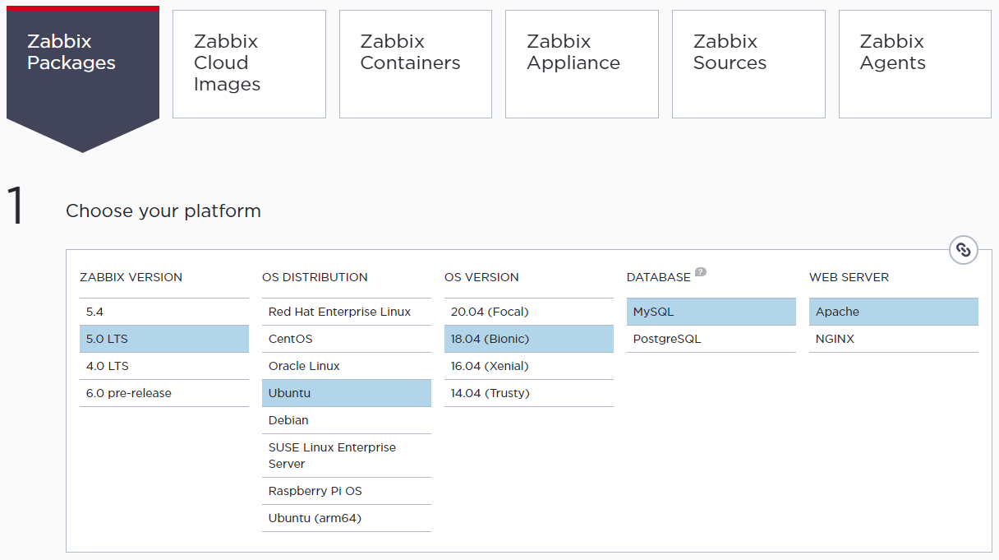

### [Index](https://github.com/PaaS-TA/Guide) > [Monitoring Install](PAAS-TA_MONITORING_INSTALL_GUIDE.md) > Zabbix Proxy


# Zabbix Proxy Install Guide
1. [개요](#1)
2. [Zabbix Proxy의 설치](#2)

 
## <div id="1">1. 개요


### 1.1. 소개
본 문서는 사용자의 IaaS 환경에 대한 시스템 자원 정보를 수집하여 실시간 컴퓨팅 자원의 사용량 또는 유휴 자원량을 측정해 PaaS-TA 플랫폼에서 사용할 수 있는 모니터링 대시보드와 연계하여 사용하기 위한 Zabbix Proxy의 설치 및 환경설정 방법에 대한 안내를 다루고 있다.


### 1.2. 범위와 한계
또한 본 가이드는 다음과 같은 설치 환경을 바탕으로 작성되었으므로 가이드에서 언급되지 않은 기타 범위에 대하여는 일부 제약이나 설치 또는 적용에 한계와 차이가 있을 수 있다.

<table>
  <tr>
    <td><b>Virtual Machine OS</b></td>
    <td>Ubuntu 18.04.6 LTS (Bionic)</td>
  </tr>
  <tr>
    <td><b>IaaS Vendor SW</b></td>
    <td>OpenStack 5.4.0 (Stein)
    </td>
  </tr>
</table>
 
 
### 1.3. Proxy 인스턴스 권장 사양
사용자의 IaaS 플랫폼을 통해 Zabbix Proxy 설치를 위한 인스턴스를 생성한다. Zabbix 모니터링 환경에서 Proxy 구성을 위한 인스턴스 사양으로는 다음을 권장하고 있다.

**│ OpenStack Default Flavor - m1.large**
<table>
  <tr>
    <td><b>CPU</b></td>
    <td>4 Core 이상</td>
  </tr>
  <tr>
    <td><b>RAM</b></td>
    <td>8 GB 이상</td>
  </tr>
  <tr>
    <td><b>DISK</b></td>
    <td>80 GB 이상</td>
  </tr>
</table>


## <div id="2">2. Zabbix Proxy의 설치


### 2.1. 운영 환경 선택
Zabbix 공식 홈페이지를 방문하면 [다운로드](https://www.zabbix.com/download) 페이지를 통해 설치하고자 하는 Zabbix 버전, 운영체제 종류와 버전 등을 선택하여 사용자의 운영 환경에 알맞는 설치 스크립트를 제공 받을 수 있다.



**Zabbix Packages** 탭에서 제공 받을 수 있는 설치 스크립트를 통해 Zabbix Server, Proxy, Agent 등 Zabbix 관련 패키지를 모두 설치할 수 있는 저장소 정보를 내려 받을 수 있다. 이 단계에서는 Zabbix Proxy만 설치하면 되기 때문에 기타 Zabbix 패키지 설치와 관련된 스크립트는 생략하고 Zabbix Proxy 설치와 데이터베이스 설정 관련 스크립트만 따라 수행하도록 한다.

본 가이드에서는 Ubuntu 18.04 운영체제에서 Zabbix 5.0 LTS 버전의 Proxy, 데이터베이스 SW로는 MySQL 구성으로 선택해 설치하였다. 따라서 가이드 내용이 운영체제나 데이터베이스 또는 웹 서버 SW 종류에 따라 설치 스크립트가 일부 다를 수 있으므로 Zabbix 공식 홈페이지에서 확인할 수 있는 설치 스크립트를 참고하는 것을 권장한다.


### 2.2. Zabbix Proxy 설치
Zabbix 저장소를 설치한다.
```
$ wget https://repo.zabbix.com/zabbix/5.0/ubuntu/pool/main/z/zabbix-release/zabbix-release_5.0-1+bionic_all.deb
$ sudo dpkg -i zabbix-release_5.0-1+bionic_all.deb
$ sudo apt update
```

Zabbix Proxy를 설치한다.
```
$ sudo apt install -y zabbix-proxy-mysql
```

서버의 데이터베이스가 작동(활성화) 상태인지 확인한 후 다음과 같이 데이터베이스 및 계정을 생성한 후 데이터베이스 프롬프트에서 빠져나온다.
```
$ mysql -uroot -p
Enter password: 

...

mysql> create database zabbix_proxy character set utf8 collate utf8_bin;
mysql> create user zabbix_proxy@localhost identified by 'paasta';
mysql> grant all privileges on zabbix_proxy.* to zabbix_proxy@localhost;
mysql> quit;
```

생성한 `zabbix_proxy` 데이터베이스에 다음과 같이 Zabbix 운영에 필요한 스키마와 데이터를 삽입한다. 이 때 앞서 생성한 계정의 비밀번호를 요구하므로 알맞은 비밀번호를 입력해준다(가이드에서는`paasta`로 설정하였다).
```
$ zcat /usr/share/doc/zabbix-proxy-mysql/schema.sql.gz | mysql -uzabbix_proxy -p zabbix_proxy
Enter Password:
```

Zabbix Proxy 설정을 위해 `/etc/zabbix/zabbix_proxy.conf` 파일의 다음 항목들을 각 사용자의 환경에 알맞게 편집한다.
```
...

ProxyMode=0

...

Server=10.10.10.10

...

ServerPort=10051

...

Hostname=zabbix proxy 01

...

ListenPort=10051

...

DBHost=11.11.11.11

...

DBName=zabbix_proxy

...

DBUser=zabbix_proxy

...

DBPassword=paasta

...

DBPort=3306

...

ConfigFrequency=100	

...
```

> **[ 주요 설정 파라미터 ]**  
. `ProxyMode`: `0`은 액티브 모드, `1`은 패시브 모드.  
. `Server`: Zabbix Server의 IP 주소를 입력.  
. `ServerPort`: Zabbix Server와 통신하기 위한 목적지 포트 번호.  
. `Hostname`: 호스트명을 입력. 이곳에 설정된 값이 Zabbix Server 프록시 설정에서 프록시명으로 사용됨.    
. `ListenPort`: Zabbix Server 및 Agent와 통신하기 위한 포트 번호.  
. `DBHost`: DB IP 주소를 입력.  
. `DBName`: DB 이름을 입력.  
. `DBUser`: DB 유저 정보를 입력.  
. `DBPassword`: DB 액세스 유저의 비밀번호를 입력.  
. `DBPort`: DB 서비스 포트 번호를 입력.  
. `ConfigFrequency`: Zabbix Proxy가 Zabbix Server로부터 설정 데이터를 검색하는 빈도.

생성한 `zabbix` 데이터베이스에 다음과 같이 Zabbix 운영에 필요한 스키마와 데이터를 삽입한다. 이 때 앞에서 생성한 계정의 비밀번호를 요구하므로 알맞은 비밀번호를 입력해준다(가이드에서는`paasta`로 설정하였다).
```
$ zcat /usr/share/doc/zabbix-server-mysql*/create.sql.gz | mysql -uzabbix_proxy -p zabbix_proxy
Enter Password:
```

프로세스를 재시작하여 Zabbix Proxy 설치를 완료한다.
```
$ sudo systemctl restart zabbix-proxy
$ sudo systemctl enable zabbix-proxy
```

Zabbix Proxy 설치가 마무리 되었다면 Zabbix Server 설치 가이드의 **'3.3. Create proxy(프록시 설정)'** 항목으로 돌아가 프록시 설정 단계를 이어서 수행한다.

### [Index](https://github.com/PaaS-TA/Guide) > [Monitoring Install](PAAS-TA_MONITORING_INSTALL_GUIDE.md) > Zabbix Proxy
