### [Index](https://github.com/PaaS-TA/Guide-eng) > [Monitoring Install](PAAS-TA_MONITORING_INSTALL_GUIDE.md) > Zabbix Server


# Zabbix Server Install Guide
1. [Outline](#1)
2. [Installation of Zabbix Server](#2)
3. [Environment Settings Required for PaaS-TA Platform](#3)


## <div id="1">1. Outline


### 1.1. Introduction
This document provides guidance on how to install and configure Zabbix Server for use in conjunction with monitoring dashboards available on the PaaS-TA platform by collecting system resource information about the user's IaaS environment, measuring the usage or idle resources of real-time computing resources.


### 1.2. Range and Limitation
This guide is based on the following installation environment, so there may be some restrictions or limitations in installation or application for other areas not mentioned in the guide...
<table>
  <tr>
    <td><b>Physical Node OS</b></td>
    <td> CentOS Linux 7.8.2003</td>
  </tr>
  <tr>
    <td><b>IaaS Vendor SW</b></td>
    <td> OpenStack 5.4.0 (Stein)
    </td>
  </tr>
</table>


## <div id="2">2. Installation of Zabbix Server


### 2.1. Select Operation Environment
In the Official Website of Zabbix, you can select the version of Zabbix you want to install through the [Download](https://www.zabbix.com/download) page. The type and version of the user's operating system and receive an installation script suitable for the user's operating environment...
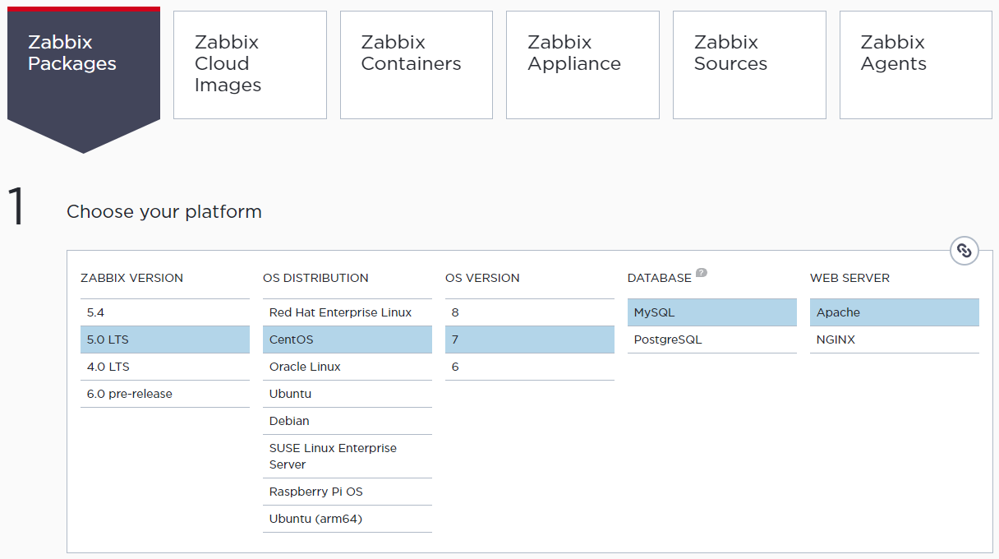

The installation script available on the **Zabbix Packages** tab allows you to download storage information that allows you to install all Zabbix-related packages, such as Zabbix Server, Proxy, Agent. The system monitoring of the Physical Node itself on which the Zabbix Server will be installed is also required, so the Zabbix Server and the Zabbix Agent are installed together through the installation of the package.

In this guide, the Zabbix 5.0 LTS version of Server and Agent was installed on the CentOS 7 operating system, MySQL for database SW, and Apache for web server SW. Therefore, it is recommended that you refer to the installation script available on the Zabbix official website, as the content of the guide may vary in part depending on the operating system, database, or web server SW type.


### 2.2. Zabbix Packages Installation
Install Zabbix Repository.
```
# rpm -Uvh https://repo.zabbix.com/zabbix/5.0/rhel/7/x86_64/zabbix-release-5.0-1.el7.noarch.rpm
# yum clean all
```

Install Zabbix Server and Zabbix Agent.
```
# yum -y install zabbix-server-mysql zabbix-agent
```

Install Red Hat software collection for installation of Zabbix Frontend.
```
# yum -y install centos-release-scl
```

Modify the `/etc/yum.repos.d/zabbix.repo` file to activate the Zabbix front-end repository. 
```
...

[zabbix-frontend]

...

enabled=1

...
```

Install Zabbix Frontend Package.
```
# yum -y install zabbix-web-mysql-scl zabbix-apache-conf-scl
```

After verifying that the server's database is operational (enabled), create the database and account as follows, and exit the database command prompt.
```
# mysql -uroot -p
Enter password:

...

mysql> create database zabbix character set utf8 collate utf8_bin;
mysql> create user zabbix@localhost identified by 'paasta';
mysql> grant all privileges on zabbix.* to zabbix@localhost;
mysql> quit;
```

The schema and data necessary for Zabbix operation are inserted into the generated `zabbix` database as follows. At this time, since the password of the previously created account is requested, the appropriate password is entered (Set as `paasta` in the guide).
```
# zcat /usr/share/doc/zabbix-server-mysql*/create.sql.gz | mysql -uzabbix -p zabbix
Enter Password:
```

Find the `DBPassword` part in the `/etc/zabbix/zabbix_server.conf` ile and add the database password of the Zabbix Server as follows. 
```
...

DBPassword=paasta

...

HostMetadata=openstack

...
```

Modify the PHP setting file for Zabbix Frontend. Change the time zone setting in the `/etc/opt/rh/rh-php72/php-fpm.d/zabbix.conf` file to a time appropriate for the user environment. Remove the `;` symbol if there is any.
```
...

php_value[date.timezone] = Asia/Seoul

...
```

Restart the Zabbix Server, Agent, and Frontend related packages.
```
# systemctl restart zabbix-server zabbix-agent httpd rh-php72-php-fpm
# systemctl enable zabbix-server zabbix-agent httpd rh-php72-php-fpm
```

You can now access the Zabbix front-end installation page through an Internet browser. <b> Access 'http://<i>{your_server_ip_or_name}</i>/zabbix'</b> and complete the Zabbix frontend installation according to the instructions for each step.

**① Welcome** - Start the installation with the 'Next step' button.

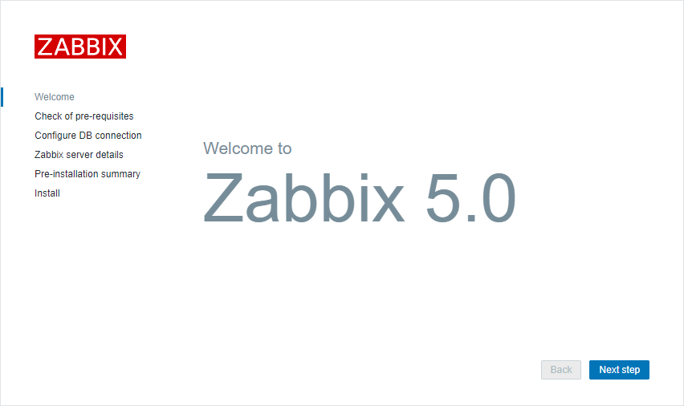

**② Check of pre-requisites** - All items shall be in the 'OK' state.

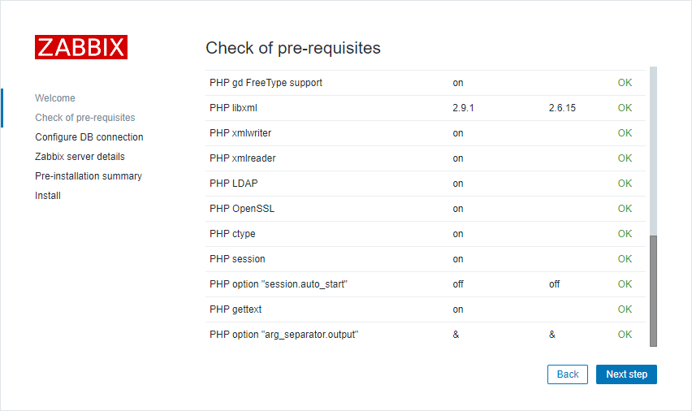

**③ Configure DB connection** - In this guide, it is assumed that DB is used in a local environment. The corresponding settings are set appropriately for each user's installation environment.

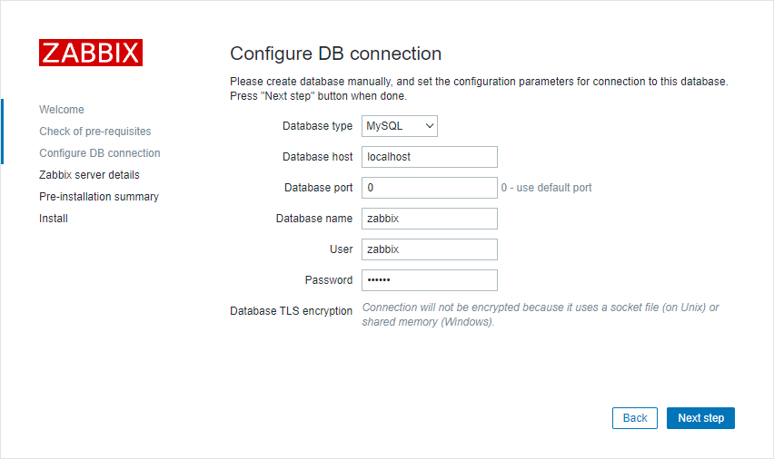

**④ Zabbix-server details** - Enter hostname information, etc. Only the port number can be entered accurately, and the remaining values can be arbitrarily set and used by the user.

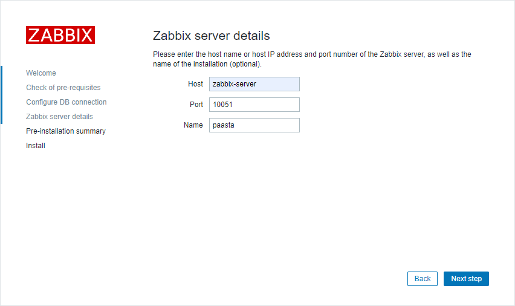

**⑤ Pre-installation summary** - Check installation summary information.

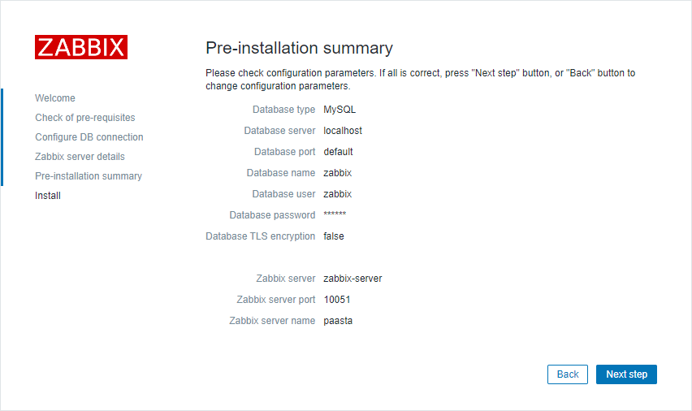

**⑥ Install** - Installation Completed.


**⑦ Login** - Login using the operator account information(Username: Admin, Password: zabbix).

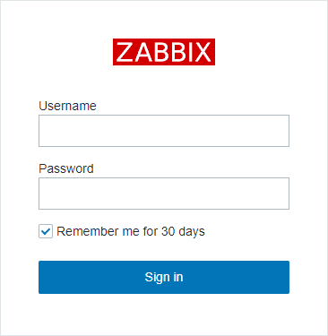

**⑧ Monitoring > Dashboard(Global view)** - The Global view page will be shown if logged in.

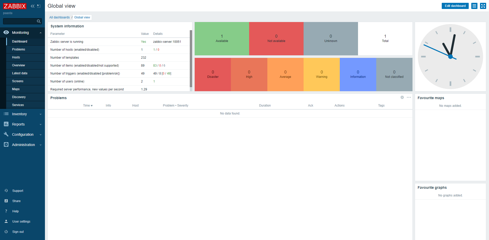

**⑨ Monitoring > Hosts** - Go to the Hosts page and verify if the Agent installed in the local environment is connected(if the 'ZBX' icon is on the green, it is connected). The Zabbix agent in the local environment where the Zabbix server is installed is automatically connected.

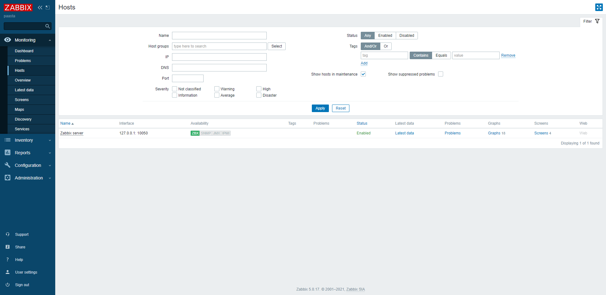


## <div id="3">3. Environment Settings Required for PaaS-TA Platform


### 3.1. Create Host Group(Necessary Host Group)
Describes how to create host groups that must be set up for IaaS monitoring on the PaaS-TA platform.

Go to the **Configuration > Host groups** menu to create a monitoring host group through the 'Create host group' button in the upper right corner.

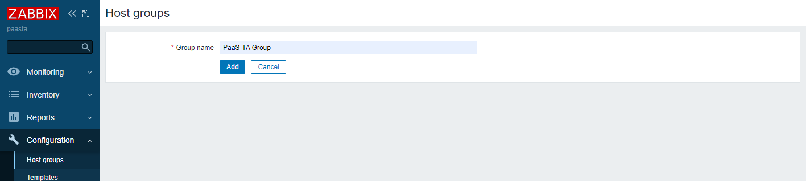

As described above, user-defined host groups can be created, and the host groups that should be set up in the IaaS monitoring environment of the PaaS-TA platform are as follows. 

> **[ Necessary Host Group ]**   
. PaaS-TA Group  
. Openstack hypervisors

<table>
  <tr>
    <td >⚠️ Since IaaS monitoring on the PaaS-TA platform is designed to work properly with the same settings as the required host group list be careful when <b>creating groups by distinguishing between case letters and spacing as described in this document.</b></td>
  </tr>
</table>


### 3.2. Autoregistration actions(Host Auto-registering Setting)
Describes how to set **'Auto registration actions'** options that must be set up for IaaS monitoring on the PaaS-TA platform. The options vary depending on the required host groups created earlier. Refer to the information provided in the following guide.

**│ PaaS-TA Group**  

Go to the **Configuration > Actions** menu and go to the **' Auto registration actions'** Settings page in the drop-down menu at the top left.

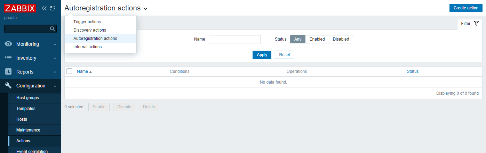

Press the 'Create action' button on the upper right to create a new action (rule) for auto-registration of the host. Assign the appropriate action name and then add the condition through 'Add' in the 'Condition' column. The new conditions to be added are specified as follows.

> **[ Action > Conditions > New condition ]**  
. Type: Host metadata  
. Operator: contains  
. Value: paasta

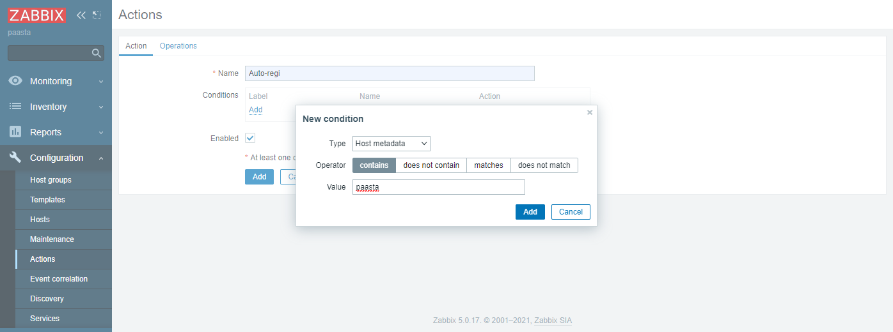

This condition setting allows Zabbix Server to set up a separate setting only for hosts that contain a string called "paasta" in the "Host metadata" type among the numerous hosts detected in the network.

Go to the 'Operations' Tab and add the following settings.

> **[ Operations ]**  
. <b>Add host</b>  
. <b>Add to host groups:</b> PaaS-TA Group  
. <b>Link to templates:</b> Template OS Linux by Zabbix agent  
. <b>Enable host</b>

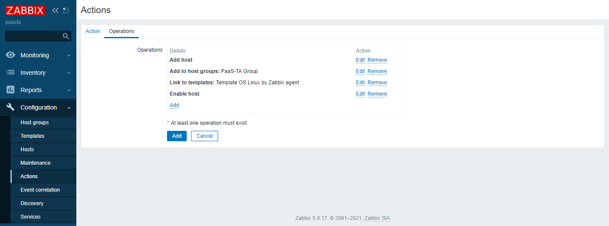

Press the 'Add' button to finally add the action setting. This action setting allows Zabbix Server to automatically register as a monitoring host, grouped as 'PaaS-TA Group', for hosts that contain a string "paasta" in the "Host metadata" type among the many hosts detected in the network.

**│ Openstack hypervisors** 

Set the action for the 'Openstack hypervisors' group in the same way, but refer to the following for setup options. 

> **[ Action > Conditions > New condition ]**  
. Type: Host metadata  
. Operator: contains  
. Value: openstack

> **[ Operations ]**  
. <b>Add host</b>  
. <b>Add to host groups:</b> Openstack hypervisors  
. <b>Link to templates:</b> Template OS Linux by Zabbix agent  
. <b>Enable host</b>


### 3.3. Create proxy(Proxy Settings)
Learn how to register the node (instance) information on which the Zabbix Proxy is installed through the front end of the Zabbix Server. Since Zabbix Proxy is required to proceed with this step, first complete the [Zabbix Proxy Installation](https://github.com/PaaS-TA/monitoring-guide-eng/blob/master/install/PAAS-TA_MONITORING_ZABBIX-PROXY_INSTALL.md)and then return to the current guide to continue the step.
 
Go to the **Administration > Proxies** menu and click the 'Create proxy' on the top right for Proxy settings. Enter the Proxy information according to each user setting based on the configuration value set when installing the Zabbix Proxy (Refer to `zabbix-proxy.conf` File) and complete the setup.

> **[ Proxy ]**  
. Proxy name: zabbix proxy 01  
. Proxy mode: Active  
. Proxy address: 11.11.11.11

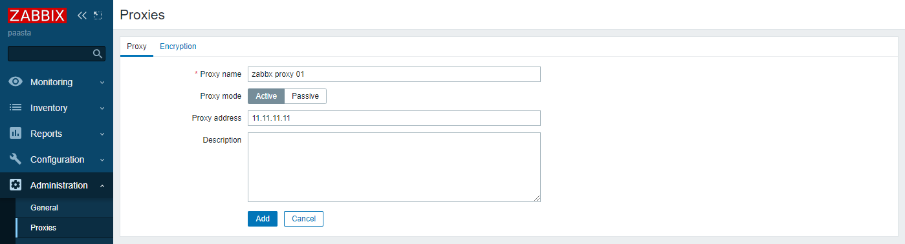

In an OpenStack environment, it is designed to serve as a relay between PaaS-TA networks isolated by virtual networks by assigning Floating IP to Proxy instances. The 'Proxy address' column allows the Floating IP assigned to the Proxy instance to be set.

<table>
  <tr>
    <td >✒️ For additional information, you can simply test the monitoring function by installing only the Zabbix Server without using the Zabbix Proxy. For example, if Zabbix Server is installed on Inception VM, not Physical Node, and Zabbix Agent deployed to each VM in PaaS-TA AP environment sets Zabbix Server information to Inception VM, it will be directly connected to the server without going through Zabbix Proxy.</td>
  </tr>
</table>

### [Index](https://github.com/PaaS-TA/Guide-eng) > [Monitoring Install](PAAS-TA_MONITORING_INSTALL_GUIDE.md) > Zabbix Server
